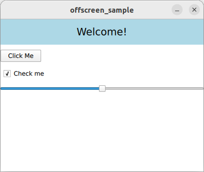

# Offscreen Rendering

Rendering into a custom framebuffer, also known as off-screen rendering or rendering to a texture, plays a crucial role in numerous scenarios within computer graphics and game development. This repo is just an example that demonstrates how this can be effortlessly achieved using the Qt framework (version 6.6 is used).



## Build and run

```bash
cmake -B build -S .
cmake --build build --parallel
./build/offscreen_sample
```